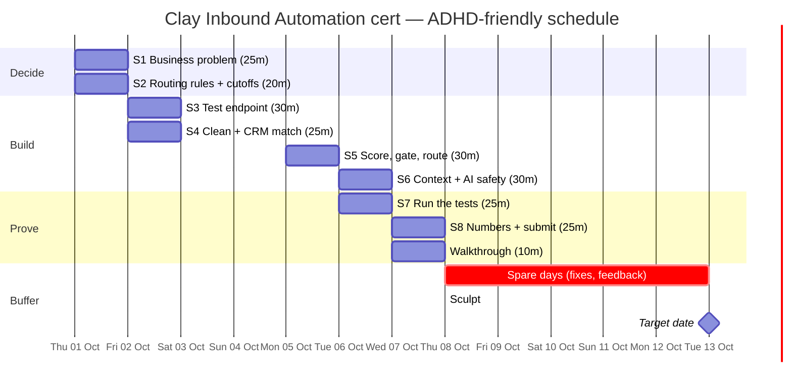

# Clay Certification: Inbound Automation (Vantis) — ADHD-friendly plan

Source: Clay Cohorts brief "Inbound automation — Vantis: Automated Inbound" (Step 1 of 5, The Brief).
Read from a screenshot-PDF. The screenshot cuts off partway through "Tests to run", so the test list below is rebuilt from the 12 requirements and 15 checks.

## The brief in 60 seconds

| Fact | Detail |
|---|---|
| Build | An inbound flow in Clay (tables, workflows, or both) for **Vantis**, a fictional security company |
| Problem | Median **9 hours** to assign an owner. Requests reach the wrong person. Reps pitch existing customers as new prospects |
| Goal | Qualified demo requests reach the right owner in **5 minutes** (business hours), with context for a great first conversation |
| Effort | About **2 hours** build + a walkthrough of **10 minutes max** |
| Pass mark | **22.5 / 25** on the build and the interview |
| Dates | Certifications issued at **Sculpt, Oct 8 2026**. **Target date Oct 13** |
| Data | Download the **test data** and the **owner list** (synthetic; keep out of anything real) |
| Feedback | This is a first-batch alpha. Scores may change. Use "Share alpha feedback" |

Working assumption: **submit by Wed Oct 7**, so you are in the Oct 8 issue batch. Oct 8–13 is spare buffer, not planned work.
(The brief says Oct 8 issue day and Oct 13 target date and doesn't spell out which is the submission deadline. Worth checking on the page.)

---

## Rules for the plan (built for ADHD traits)

1. **One session = one job.** Max 30 minutes. Every session has a "done when" line, so you know when to stop.
2. **Decide first, build second.** Routing rules and score cutoffs get written down *before* opening Clay (requirement 6). Fewer mid-build decisions means fewer stalls.
3. **Start ugly.** Get a thin version working end to end, then improve. Perfect is not the target; 22.5/25 is.
4. **Start small.** Each session opens with a 2-minute "restart note" you wrote at the end of the last one: *"Next: ___. Open: ___."*
5. **Body double.** Book each session with a buddy (call, silent co-working, or a timer with a friend). Starting is the hard part.
6. **Parking lot.** New ideas go in one note called `PARKING LOT`. Do not act on them until after submission.
7. **Timer on, phone away.** 25 min work, 5 min break. Stand up on every break.
8. **Tick things off visibly.** The checklist at the bottom is your dopamine. Tick it the moment something is done.
9. **Buffer is protected.** If a session slips, use the next free slot. Do not stack two on one day.

---

## Action plan

Total planned time: **about 3.5 hours over 5 working days** (the brief says ~2 hours of pure build; the rest is warm-up, testing and write-up padding).

### Day 1 — Thu Oct 1: Understand and decide (45 min)

**S1 · 25 min · The business problem** (requirement 1)
- Download the test data and owner list. Put them in one folder.
- Write 5 lines: what Vantis needs, who you're helping (Head of RevOps), why now, success metric and target (e.g. "share of qualified requests reaching the right owner within 5 minutes: 95%"), what would disappoint them.
- Done when: five lines saved.

**S2 · 20 min · Routing rules and cutoffs, on paper** (requirements 4 and 6)
- Write: what decides the owner (segment, territory, account ownership, or round robin)?
- Write: what happens outside business hours, when someone is away, when info is missing.
- Write: fit score cutoffs and intent score cutoffs → "rep now" / "nurture" / "disqualified". Uncertain records go to a named human reviewer.
- Done when: one page of rules exists. No Clay yet.

### Day 2 — Fri Oct 2: Front door and matching (55 min)

**S3 · 30 min · Test endpoint** (requirement 2)
- Endpoint checks the sender's credentials and the request format.
- Each request gets a stable ID. Invalid requests are rejected before any paid step.
- Strip secrets from anything you'll submit.
- Done when: a bad-credentials request and a bad-format request are both rejected.

**S4 · 25 min · Clean and match** (requirement 3)
- Clean emails and domains. Match person and account against the test CRM.
- Existing customers go to expansion or their current owner. Open opportunities stay with their owners.
- Done when: an existing customer is *not* treated as a new lead.

*Weekend: nothing planned. Rest is part of the plan.*

### Day 3 — Mon Oct 5: Scoring and routing (30 min)

**S5 · 30 min · Score, gate, route** (requirements 4, 5, 10)
- Score fit and intent separately, using your S2 cutoffs. Route: sales / support / disqualified / incomplete.
- Enrich only the fields you need (size, region, industry, existing account), in dependency order.
- Paid and AI steps run only after earlier checks pass. Missing domain or uncertain data = stop.
- Done when: each of the four request types lands at the right destination.

### Day 4 — Tue Oct 6: Context, safety, tests (55 min)

**S6 · 30 min · Owner context and AI safety** (requirements 7, 8, 12)
- Every routed record carries a summary from *verified* data: who, company, ask, why they fit, site visits (last 14 days), open opportunity or ticket, suggested opening.
- Draft replies without sending them. No claims the data doesn't support.
- Test: an AI claim without a source, and instructions hidden in source data. (No AI? Show that in settings.)
- Write down one change you made after testing, and which templates or AI tools helped.
- Done when: both AI tests are recorded.

**S7 · 25 min · Run the real tests** (requirement 9)
Tick each as you run it, and save the evidence (screenshot or log):
- [ ] Invalid credentials rejected. Wrong format rejected. Neither triggers enrichment or routing
- [ ] Good input: routed with owner and reason
- [ ] Existing customer stays with owner
- [ ] Support request goes to support
- [ ] Incomplete request goes to review
- [ ] Missing domain stops paid enrichment and AI drafting
- [ ] Failed data provider: limited retries, recovers without double write
- [ ] Failed delivery: limited retries, recovers without double write
- [ ] Same input sent again one after another: no second write or delivery
- [ ] Same input sent at the same time: no second write or delivery

### Day 5 — Wed Oct 7: Measure, write up, submit (25 min + 10 min)

**S8 · 25 min · Numbers and submission** (requirements 8, 10, 11)
- Timestamps: arrival → owner assigned, compared with the 5-minute target.
- Run time and cost. Label estimates clearly. Calculate 10× volume.
- Show who reviews uncertain records and how they stop, inspect and safely restart the automation.
- Submit.
- Done when: submitted. Stop there.

**Walkthrough · 10 min max.** Talk through: problem → rules → one good case → one failure case → numbers. Use the Day 1 page as your script.

### Oct 8–13 — Buffer
Sculpt issue day is Oct 8. Certification arrives that day or within a few days. Only use this window to fix issues or give alpha feedback.

---

## Gantt chart



Plain-text version (if the chart doesn't render):

```
            Thu1  Fri2  Sat3 Sun4  Mon5  Tue6  Wed7  Thu8  Fri9 ... Tue13
S1 problem   ██
S2 rules     ██
S3 endpoint        ██
S4 match           ██
S5 score                          ██
S6 context+AI                           ██
S7 tests                                ██
S8 submit                                     ██
Walkthrough                                   ██
Buffer                                              ░░░░░░░░░░░░░░░░░░
Milestones                                          ◆ Sculpt       ◆ target
                   (Sat/Sun = rest)
```

---

## RACI

R = Responsible (does it) · A = Accountable (owns the outcome, one per row) · C = Consulted · I = Informed

| Task | You | Buddy (body double) | Claude / AI helper | Clay (assessor) | Vantis Head of RevOps (fictional client) |
|---|---|---|---|---|---|
| Book the 8 sessions in your calendar | A/R | C | I | | |
| S1 Write business problem + success metric | A/R | C | C | | I |
| S2 Write routing rules + score cutoffs | A/R | C | C | | C |
| S3 Build test endpoint (auth + format + stable ID) | A/R | I | C | | |
| S4 Clean identifiers + match against test CRM | A/R | I | C | | |
| S5 Score fit/intent, gate paid steps, route | A/R | I | C | | I |
| S6 Owner context summary + AI safety tests | A/R | I | C | | I |
| S7 Run and record the tests | A/R | C | C | | |
| S8 Measure time and cost (incl. 10× volume) | A/R | I | C | | I |
| Disclose which AI tools/templates helped | A/R | | C | I | |
| Submit build | A/R | I | | I | |
| 10-minute walkthrough | A/R | C (practice audience) | C (rehearsal) | I | |
| Assess submission and score (22.5/25 to pass) | I | | | A/R | |
| Issue certification (Oct 8, or a few days after) | I | | | A/R | |
| Share alpha feedback | A/R | | C | I | |
| Weekly "am I on track?" check-in | A/R | R | | | |

Notes:
- Claude/AI helping is allowed, but the brief asks you to say which tools helped (requirement 12). Keep a one-line log as you go.
- The Vantis Head of RevOps is a persona, not a real person. It's the "client" whose 5-minute target you're writing for.
- "Buddy" can be anyone: friend, colleague, or a co-working video room. If nobody is available, replace with a visible timer and a message to yourself.

---

## If you get stuck (the escape hatch)

- **Can't start:** open the file, do only the first bullet, set a 5-minute timer. You are allowed to stop after 5.
- **Stuck on one step >10 min:** write the question in the parking lot, skip to the next bullet, ask Claude or your buddy.
- **Went down a rabbit hole:** check the "Done when" line. If it's met, stop.
- **Missed a session:** move it to the next free slot. Never double up.
- **Overwhelmed:** shrink the session to the single next bullet. Progress counts at any size.
