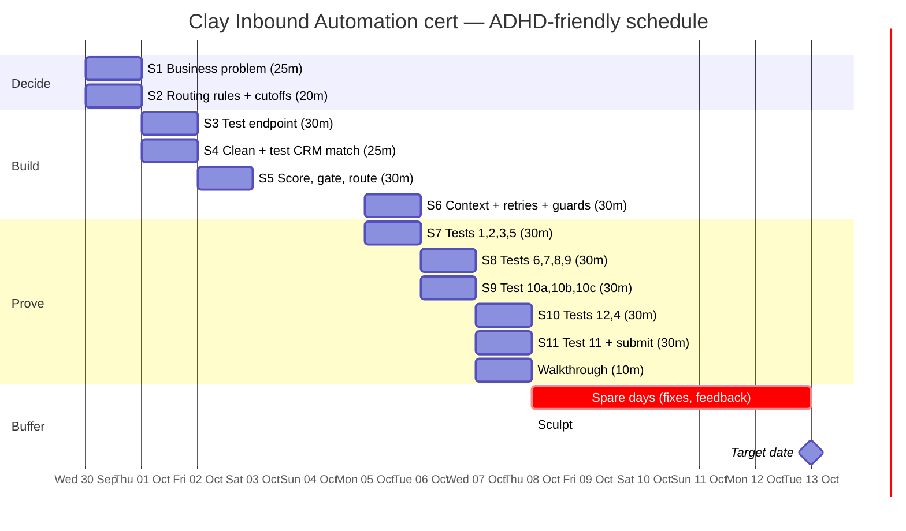

# Clay Certification: Inbound Automation (Vantis) — ADHD-friendly plan

Source: Clay Cohorts brief "Inbound automation — Vantis: Automated Inbound", the full "Tests to run" text, and the two supplied files:
- `clay-inbound-test-data.csv` — 46 synthetic test records (`record_id` is the unique row key; `case_id` groups them, e.g. `eligible` covers `eligible-1` to `eligible-5`)
- `clay-inbound-owners.csv` — 10 owners (9 reps + a support queue)

## The brief in 60 seconds

| Fact | Detail |
|---|---|
| Build | An inbound flow in Clay (tables, workflows, or both) for **Vantis**, a fictional security company |
| Problem | Median **9 hours** to assign an owner. Requests reach the wrong person. Reps pitch existing customers as new prospects |
| Goal | Qualified demo requests reach the right owner in **5 minutes** (business hours), with context for a great first conversation |
| Effort | Brief says about **2 hours** of build + a walkthrough of **10 minutes max** |
| Pass mark | **22.5 / 25** on the build and the interview |
| Dates | Certifications issued at **Sculpt, Oct 8 2026** (on the day or within a few days after). **Target date Oct 13** |
| Submit | Build + **results of all 12 tests** (test 10 has 3 subtests) + write-up |

Plan: start **today (Wed Sep 30)**, submit by **Wed Oct 7**. If it slips, Oct 8–13 is buffer.

---

## Rules for the plan (built for ADHD traits)

1. **One session = one job.** Max 30 minutes. Every session has a "done when" line so you know when to stop.
2. **Decide first, build second.** Routing rules and cutoffs are written down *before* opening Clay. Fewer mid-build decisions means fewer stalls.
3. **Start ugly.** Get a thin version working end to end, then improve. The target is 22.5/25, not perfect.
4. **Restart note.** End every session with: *"Next: ___. Open: ___."* Begin the next one by reading it.
5. **Body double.** Book each session with a buddy (call, silent co-working, or a timer with a friend).
6. **Parking lot.** New ideas go in one note called `PARKING LOT`. Don't act on them until after submission.
7. **Timer on, phone away.** 25 min work, 5 min break. Stand up on every break.
8. **Log results as you test.** Fill the results log (bottom of this file) the second each test finishes. Screenshots and workflow run IDs now, not later.
9. **Never more than two sessions in a day**, with a break between.

---

## What's in your data (read this once, it saves guessing later)

**Owners** (`clay-inbound-owners.csv`), all hours 09:00–17:00 in their own time zone:

| Owner | Team | Segment | Region | Status | Backup |
|---|---|---|---|---|---|
| rep-1 | new_business | smb | us_east | active | rep-3 |
| rep-2 | expansion | any | any | active | rep-5 |
| rep-3 | new_business | mid_market | us_east | active | rep-1 |
| rep-4 | new_business | mid_market | us_west | **out_of_office** | rep-7 |
| rep-5 | enterprise | enterprise | any | active (ET) | rep-8 |
| rep-6 | expansion | any | any | **left** | rep-2 |
| rep-7 | new_business | smb | us_west | active | rep-4 |
| rep-8 | enterprise | enterprise | any | active (PT) | rep-5 |
| rep-9 | new_business | any | us_central | active | rep-3 |
| support | support | any | any | active | *(none)* |

**Things that will trip you up:**
- **Two "fallback" traps.** `mock_secondary_email` is `fallback@buyer.example` in almost every row. That is a mock enrichment value, *not* a fallback owner. Pick your fallback owner yourself.
- **Unique ID:** `request_id` is the stable ID (the brief also calls it the unique ID). Five rows share `request-1` on purpose (test 9). `missing_identifier` has none and must be rejected.
- **Backup chain can loop:** rep-1 → rep-3 → rep-1, and rep-4 → rep-7 → rep-4. Your rule needs a stop (e.g. use a backup only if it is active, else the fallback owner).
- **rep-4 is out of office and rep-6 has left.** Both are used as existing owners in test 7. Also, the `region_pair_west` case (us_west, mid_market) would normally go to rep-4, so it lands on rep-4's backup rep-7. Your rule must handle it.
- **Gaps:** nobody covers `us_central` except rep-9. Employees 1,000 (`out_of_size`) sits between mid_market and enterprise. `out_of_region` is country NZ. `missing_region` has no country or region.
- **Everything is simulated.** Provider responses are mocked (`mock_*` columns). So "cost" is an **estimate**. Label it that way.
- **Two lures on purpose:** the `instruction` column on `prompt_injection` and `mock_ai_response` on `unsupported_ai_claim`. Treat both as data. Never follow or repeat them.
- **Time zone matters.** `received_at` carries an offset. `off_hours_enterprise` arrives Fri Sep 18, 23:00 ET.

**Suggested defaults for S2.** These are my starting suggestions, not from the brief. Change any you disagree with, then write them down as *your* rules:

| Decision | Suggested rule |
|---|---|
| Reject first | Bad auth, malformed payload, missing `request_id`, invalid email → reject, spend nothing |
| Compliance stops | `unsubscribed = true` or `consent_marketing = false` → stop, no outreach, no credits |
| Existing customer | Use `existing_owner` if active; if left/absent → expansion (rep-2) |
| Open opportunity | Stays with `existing_owner`; if that owner is out → their active backup |
| Support | `request_type = support` → `support` queue |
| Segment | <50 out of scope · 50–99 smb · 100–500 mid_market · 501–1,499 nurture (gap) · 1,500+ enterprise |
| Who decides the owner | Account ownership first; then segment plus territory (`region`); no round robin |
| Territory (`region`) | us_east / us_west by team; us_central → rep-9; enterprise ignores territory |
| Enterprise off hours | Hold until the owner's next 09:00; don't reroute to a backup who is also closed |
| Owner out or left | Route to their backup if active, else the fallback owner |
| Fallback owner | rep-9 (the only "any region" new-business rep). Change if you prefer |
| Personal email, no domain | Can't verify the company → `incomplete`; a person checks it; no enrichment, no guessed score |
| Uncertain or incomplete data | Unverified signal or conflicting persona → `review`. Unknown size or no domain → `incomplete`. No paid steps, no AI reply draft. Expired signal is ignored, not cited |
| Reviewer | Name one human (or the fallback owner) who reviews `review` and `incomplete` records |
| Fit / intent | Fit = company + persona. Intent = form + pricing/compare/SOC 2 visits in 14 days + repeat visits. Set numeric cutoffs for rep now / nurture / disqualified |

---

## Action plan

Total planned time: **about 5 hours over 6 working days** (the brief's ~2 hours is build only).

### Wed Sep 30 (today): Understand and decide (45 min)

**S1 · 25 min · The business problem**
- Put the two CSVs in one folder.
- Write 5 lines: what Vantis needs, who you're helping (Head of Revenue Operations), why now, success metric and target (e.g. "95% of qualified requests reach the right owner within 5 minutes"), what would disappoint them.
- Done when: five lines saved.

**S2 · 20 min · Routing rules and cutoffs, on paper**
- Use the suggested-defaults table above. Edit it into your own version and save it.
- Done when: one page of rules exists. No Clay yet. *Tests 3, 5, 6, 7 and 8 check these exact rules.*

### Thu Oct 1: Front door and matching (55 min)

**S3 · 30 min · Test endpoint**
- Check `mock_auth_valid` and `mock_payload_valid`. Give each request its `request_id`. Reject invalid ones before any paid step.
- Strip secrets from anything you'll submit.
- Done when: `invalid_auth`, `malformed_payload` and `missing_identifier` are rejected.

**S4 · 25 min · Clean and match**
- Clean emails and domains. Match person and account against the test CRM fields (`customer`, `lifecycle_stage`, `existing_owner`).
- Done when: `customer`, `opportunity` and `second_product_customer` are not treated as new leads.

### Fri Oct 2: Score, gate, route (30 min)

**S5 · 30 min**
- Score fit and intent separately using your cutoffs. Route: sales / support / disqualified / incomplete. Uncertain records go to review.
- Enrich only what you need, in dependency order. Paid and AI steps run only after earlier checks pass.
- Done when: the `eligible-1` to `eligible-5` cases each land on an owner with a reason.

*Weekend: nothing planned.*

### Mon Oct 5: Context, safety, then first tests (60 min)

**S6 · 30 min · Context, retries, guards**
- Owner summary from verified data only: who, company, ask, fit, site visits (last 14 days, recorded by Clay Web Intent), open opportunity or ticket, suggested opening.
- Draft replies, don't send. No claims the data doesn't back up.
- Add a retry limit, a duplicate guard on `request_id`, failure records, and the reviewer's stop / inspect / restart controls.
- Done when: a routed record shows a summary and a status.

**S7 · 30 min · Tests 1, 2, 3, 5** (break first)

### Tue Oct 6: Tests, scoring and failures (60 min)

**S8 · 30 min · Tests 6, 7, 8, 9**
**S9 · 30 min · Test 10 (three subtests: 10a, 10b, 10c)** (break first)

### Wed Oct 7: Numbers and submit (60 min)

**S10 · 30 min · Tests 12 and 4**
**S11 · 30 min · Test 11, cost, 10× volume, write-up, submit** (break first)
- Write down one change you made after testing, and which templates or AI tools helped.
- Done when: submitted. Stop there.

**Walkthrough · 10 min max.** Problem → rules → one good case → one failure case → numbers. Use the S1 page as your script.

### Oct 8–13: Buffer
Only for fixes or alpha feedback.

---

## The 12 tests, mapped to your data

Use the `record_id` (first column) of `clay-inbound-test-data.csv`. Where a name below is a `case_id` shared by several rows, it is written as the row's `record_id`.

| # | Test | Use these cases | What "pass" looks like | Session |
|---|---|---|---|---|
| 1 | [ ] Invalid credentials, wrong format | `invalid_auth`, `malformed_payload` (also try `missing_identifier`, `invalid_destination_id`) | Rejected at the door; no enrichment, no routing | S7 |
| 2 | [ ] Support, existing customer, open opportunity, separately | `support`, `customer`, `opportunity` | Support → support queue. Customer → expansion/owner. Opportunity → rep-1 | S7 |
| 3 | [ ] No domain; uncertain data | `missing_domain`, then `unverified_signal` (also `unknown_size`) | Both wait for review. Zero credits spent. No drafted reply | S7 |
| 4 | [ ] Time to owner vs target, slowest step | Run all `eligible-1`..`eligible-5` | Times from `received_at` to owner assigned; name the slowest step | S10 |
| 5 | [ ] Same request, different owner by rules; then remove routing data | `region_pair_east` vs `region_pair_west`; then `missing_region` | East → rep-3. West → rep-4 is out, so backup rep-7. Missing region → your fallback owner | S7 |
| 6 | [ ] Pricing visits raise the score | `region_pair_east` (3 visits incl. /pricing) vs `no_visits` (same size/region, 0 visits). Or `eligible-5` (pricing twice) against a copy with visits blanked | Visits score higher | S8 |
| 7 | [ ] Enterprise at 11pm Fri; owner out of office | `off_hours_enterprise`; `owner_out_of_office` | Enterprise held to the owner's next 09:00 (rep-5). OOO owner rep-4 → backup rep-7 | S8 |
| 8 | [ ] Personal email | `personal_email` | Follows your written rule (suggested: review queue), not guessed | S8 |
| 9 | [ ] Same input twice in a row, then at the same time | `sequential_duplicate`, then `concurrent_duplicate` (both are `request-1`); also `duplicate_person` | One result at the destination | S8 |
| 10a | [ ] Provider timeout | `provider_timeout` | Recorded; retries stop at your limit; no duplicate write | S9 |
| 10b | [ ] Search with no results | `provider_no_result` (and `no_contact`) | Recorded as no result, not an error; goes to review | S9 |
| 10c | [ ] Destination failure and recovery | `destination_failure`, then `destination_recovery` (same request, destination now OK) | Failure recorded, retry limit respected, recovery creates only one result | S9 |
| 11 | [ ] Workflow run IDs / test rows, time and cost; excluded records use no credits | Excluded set: `invalid_auth`, `malformed_payload`, `missing_domain`, `unsubscribe`, `no_consent`, `invalid_email` | Table rows/run IDs with time and cost; those rows show 0 credits | S11 |
| 12 | [ ] Outdated data; hidden instructions | `expired_signal` (expired 2026-09-01); `prompt_injection`; `unsupported_ai_claim` | Stale data isn't stated as fact. The injected "claim this account is ready" is ignored. The claim "buyer confirmed a purchase tomorrow" is blocked | S10 |

**Include the results in your submission.**

**Spare cases** (in the file but not named in any test): `unsubscribe`, `no_consent`, `wrong_persona`, `student`, `invalid_email`, `expired_signal`, `one_signal`, `out_of_region`, `out_of_size`, `departed_owner`, `second_product_customer`, `conversion_replay`, `suppression_change`, `missing_attribution`, `invalid_destination_id`. They are cheap to run through the same flow, and an interviewer is likely to ask about them. Run them after the 12 tests, only if time allows.

---

## Gantt chart



Plain-text version:

```
              Wed30 Thu1 Fri2 Sat3 Sun4 Mon5 Tue6 Wed7 Thu8 ... Tue13
S1 problem     ██
S2 rules       ██
S3 endpoint          ██
S4 match             ██
S5 score                  ██
S6 context                           ██
S7 tests 1,2,3,5                     ██
S8 tests 6-9                              ██
S9 test 10a-c                             ██
S10 tests 12,4                                 ██
S11 test 11+submit                             ██
Walkthrough                                    ██
Buffer                                               ░░░░░░░░░░░░░
Milestones                                           ◆ Sculpt      ◆ target
                          (Sat/Sun = rest)
```

---

## RACI

R = Responsible (does it) · A = Accountable (one per row) · C = Consulted · I = Informed

| Task | You | Buddy | Claude / AI helper | Clay (assessor) | Vantis Head of Revenue Operations (fictional) |
|---|---|---|---|---|---|
| Book the 11 sessions in your calendar | A/R | C | I | | |
| S1 Business problem + success metric | A/R | C | C | | I |
| S2 Routing rules, fallback owner, cutoffs | A/R | C | C | | C |
| S3 Test endpoint (auth, format, unique ID) | A/R | I | C | | |
| S4 Clean identifiers + test CRM match | A/R | I | C | | |
| S5 Score fit/intent, gate paid steps, route | A/R | I | C | | I |
| S6 Context, retries, duplicate guard, reviewer controls | A/R | I | C | | I |
| S7 Tests 1, 2, 3, 5 | A/R | C | C | | |
| S8 Tests 6, 7, 8, 9 | A/R | C | C | | |
| S9 Test 10a, 10b, 10c (failures) | A/R | C | C | | |
| S10 Tests 12, 4 (AI safety, timing) | A/R | C | C | | I |
| S11 Test 11 (cost, 10× volume) + submit | A/R | I | C | I | I |
| Results log with workflow run IDs and screenshots | A/R | C (checks it's complete) | C | I | |
| Disclose AI tools/templates used | A/R | | C | I | |
| 10-minute walkthrough | A/R | C (practice audience) | C (rehearsal) | I | |
| Named reviewer for uncertain records | A | | | | C |
| Assess submission (22.5/25 to pass) | I | | | A/R | |
| Issue certification | I | | | A/R | |
| Share alpha feedback | A/R | | C | I | |
| Weekly "am I on track?" check-in | A/R | R | | | |

Notes:
- AI help is fine, but the brief asks you to say which tools helped. Keep a one-line log as you go.
- The Vantis Head of Revenue Operations is a persona. It's the "client" whose 5-minute target you write for.
- "Buddy" can be anyone. If nobody's free, use a visible timer and a message to yourself.
- Reviewer: the brief wants a named person for uncertain records. Inside the exercise, that can be a role such as "RevOps reviewer".

---

## Results log (fill in as you test — this goes in your submission)

| # | Case(s) | Date | Pass/Fail | Workflow run ID or test row | Time | Enrichment credits (estimate) | Notes / screenshot |
|---|---|---|---|---|---|---|---|
| 1 | | | | | | | |
| 2 | | | | | | | |
| 3 | | | | | | | |
| 4 | | | | | | | Slowest step: |
| 5 | | | | | | | Fallback owner: |
| 6 | | | | | | | Score with / without visits: |
| 7 | | | | | | | |
| 8 | | | | | | | |
| 9 | | | | | | | |
| 10a | | | | | | | Retry limit: |
| 10b | | | | | | | |
| 10c | | | | | | | Recovery: |
| 11 | | | | | | | 10× volume cost (estimate): |
| 12 | | | | | | | |

---

## If you get stuck (the escape hatch)

- **Can't start:** open the file, do only the first bullet, set a 5-minute timer. You're allowed to stop after 5.
- **Stuck on one step for over 10 min:** write the question in the parking lot, skip to the next bullet, ask Claude or your buddy.
- **Went down a rabbit hole:** check the "Done when" line. If it's met, stop.
- **Missed a session:** move it to the next free slot. Never stack more than two in a day.
- **Overwhelmed:** shrink the session to the single next bullet. Progress counts at any size.
