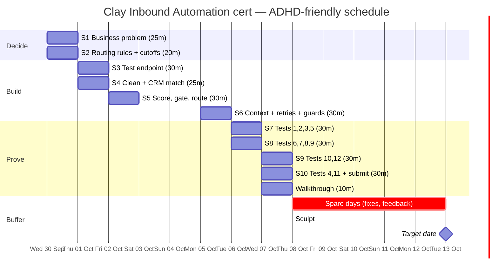

# Clay Certification: Inbound Automation (Vantis) — ADHD-friendly plan

Source: Clay Cohorts brief "Inbound automation — Vantis: Automated Inbound" (Step 1 of 5, The Brief), plus the full "Tests to run" text.

## The brief in 60 seconds

| Fact | Detail |
|---|---|
| Build | An inbound flow in Clay (tables, workflows, or both) for **Vantis**, a fictional security company |
| Problem | Median **9 hours** to assign an owner. Requests reach the wrong person. Reps pitch existing customers as new prospects |
| Goal | Qualified demo requests reach the right owner in **5 minutes** (business hours), with context for a great first conversation |
| Effort | Brief says about **2 hours** of build + a walkthrough of **10 minutes max** |
| Pass mark | **22.5 / 25** on the build and the interview |
| Dates | Certifications issued at **Sculpt, Oct 8 2026** (on the day or within a few days after). **Target date Oct 13** |
| Data | Download the **test data** and the **owner list** (synthetic; keep out of anything real) |
| Submit | Build + **results of all 12 tests** + write-up |

Plan: start **today (Wed Sep 30)**, submit by **Wed Oct 7**. If it slips, Oct 8–13 is buffer. The brief says you get the certificate on the day or within a few days after passing, so a small slip is not a disaster.

---

## Rules for the plan (built for ADHD traits)

1. **One session = one job.** Max 30 minutes. Every session has a "done when" line so you know when to stop.
2. **Decide first, build second.** Routing rules and score cutoffs are written down *before* opening Clay (requirement 6). Fewer mid-build decisions means fewer stalls.
3. **Start ugly.** Get a thin version working end to end, then improve. The target is 22.5/25, not perfect.
4. **Restart note.** End every session by writing: *"Next: ___. Open: ___."* Begin the next one by reading it.
5. **Body double.** Book each session with a buddy (call, silent co-working, or a timer with a friend). Starting is the hard part.
6. **Parking lot.** New ideas go in one note called `PARKING LOT`. Don't act on them until after submission.
7. **Timer on, phone away.** 25 min work, 5 min break. Stand up on every break.
8. **Log results as you test.** Fill the results log (bottom of this file) the second each test finishes. Screenshots and run IDs now, not later.
9. **Buffer is protected.** If a session slips, use the next free slot. Never stack more than two sessions in a day, with a break between.

---

## Action plan

Total planned time: **about 4.5 hours over 6 working days.** The brief says ~2 hours of build; the 12 tests, warm-up and write-up take the rest.

### Wed Sep 30 (today): Understand and decide (45 min)

**S1 · 25 min · The business problem** (requirement 1)
- Download the test data and owner list. Put them in one folder.
- Write 5 lines: what Vantis needs, who you're helping (Head of RevOps), why now, success metric and target (e.g. "share of qualified requests reaching the right owner within 5 minutes: 95%"), what would disappoint them.
- Done when: five lines saved.

**S2 · 20 min · Routing rules and cutoffs, on paper** (requirements 4 and 6)
- What decides the owner: segment, territory, account ownership, or round robin?
- Write the rules for: outside business hours (e.g. Friday 11pm enterprise), rep out of office, missing routing data (the **fallback owner**), personal email addresses (e.g. gmail.com), no domain, uncertain data.
- Write fit and intent score cutoffs → "rep now" / "nurture" / "disqualified". Say how pricing-page visits raise intent (last 14 days). Uncertain records go to a named human reviewer.
- Done when: one page of rules exists. No Clay yet. *Your tests 5, 7 and 8 check these exact rules.*

### Thu Oct 1: Front door and matching (55 min)

**S3 · 30 min · Test endpoint** (requirement 2)
- Check the sender's credentials and the request format.
- Give each request a stable unique ID. Reject invalid requests before any paid step.
- Strip secrets from anything you'll submit.
- Done when: bad credentials and bad format are both rejected.

**S4 · 25 min · Clean and match** (requirement 3)
- Clean emails and domains. Match person and account against the test CRM.
- Existing customers go to expansion or their current owner. Open opportunities stay with their owner.
- Done when: an existing customer is *not* treated as a new lead.

### Fri Oct 2: Score, gate, route (30 min)

**S5 · 30 min** (requirements 4, 5, 10)
- Score fit and intent separately using your S2 cutoffs. Route: sales / support / disqualified / incomplete.
- Enrich only the fields you need (size, region, industry, existing account), in dependency order.
- Paid and AI steps run only after earlier checks pass. Missing domain or uncertain data = stop for review, no credits spent, no reply drafted.
- Done when: each request type lands at the right destination.

*Weekend: nothing planned. Rest is part of the plan.*

### Mon Oct 5: Owner context and AI safety (30 min)

**S6 · 30 min** (requirements 7, 8, 12)
- Each routed record carries a summary from *verified* data: who, company, ask, why they fit, site visits (last 14 days), open opportunity or ticket, suggested opening.
- Draft replies without sending. No claims the data doesn't support.
- Set up retries (fixed limit), a duplicate guard on the unique ID, failure records, and the reviewer's stop/inspect/restart controls.
- Done when: a routed record shows a summary and a status.

### Tue Oct 6: Tests, part 1 and 2 (60 min, with a break between)

**S7 · 30 min · Gate and match tests**: tests 1, 2, 3, 5 (list below)
**S8 · 30 min · Scoring and repeat tests**: tests 6, 7, 8, 9
- Done when: each test has a result line in the log with a run ID or screenshot.

### Wed Oct 7: Failures, numbers, submit (60 min, with a break between)

**S9 · 30 min · Failure and AI tests**: tests 10 and 12
**S10 · 30 min · Numbers and submit**: tests 4 and 11, then submit
- Timestamps: arrival → owner assigned, compared with the 5-minute target. Name the slowest step.
- Run time and cost. Label estimates clearly. Calculate 10× volume.
- Write down one change you made after testing, and which templates or AI tools helped.
- Done when: submitted. Stop there.

**Walkthrough · 10 min max.** Problem → rules → one good case → one failure case → numbers. Use the S1 page as your script.

### Oct 8–13: Buffer
Sculpt issue day is Oct 8. Only use this window to fix problems or give alpha feedback.

---

## The 12 tests (from the brief; tick as you go)

| # | Test | Session |
|---|---|---|
| 1 | [ ] Send a request with invalid credentials and another with the wrong format. Neither triggers enrichment or routing | S7 |
| 2 | [ ] Test a support request, an existing customer, and an open opportunity separately. Support goes to support; existing ownership is respected | S7 |
| 3 | [ ] A request with no domain and one with uncertain data. Both wait for review with no enrichment credits spent and no reply that guesses facts | S7 |
| 4 | [ ] Measure time from receipt to owner assigned. Compare with your target and identify the slowest step | S10 |
| 5 | [ ] Two otherwise identical requests from different segments or regions go to different owners under your written rules. Then remove the routing data and show which fallback owner gets it | S7 |
| 6 | [ ] A strong-fit request from someone who visited pricing twice this week scores higher than the same request with no visits | S8 |
| 7 | [ ] An enterprise request at 11pm on a Friday, and one for a rep who's out of office, go to the owner your rules name | S8 |
| 8 | [ ] A request from a personal email (e.g. gmail.com) is scored and routed by your written rule, not guessed | S8 |
| 9 | [ ] Same input twice in a row, then twice at the same time. The unique ID gives only one result at the destination | S8 |
| 10 | [ ] Test a provider timeout and a search with no results separately. Then make the destination fail. Show how each failure is recorded, that retries stop at a set limit, and how you recover without duplicates | S9 |
| 11 | [ ] Include workflow run IDs or test rows, with the time and cost you measured. Excluded records use no enrichment credits | S10 |
| 12 | [ ] Test outdated data and instructions hidden in source data. The build doesn't turn uncertain info into facts or follow the hidden instructions | S9 |

**Include the results in your submission.**

---

## Gantt chart



Plain-text version (if the chart doesn't render):

```
            Wed30 Thu1 Fri2 Sat3 Sun4 Mon5 Tue6 Wed7 Thu8 ... Tue13
S1 problem   ██
S2 rules     ██
S3 endpoint        ██
S4 match           ██
S5 score                ██
S6 context                         ██
S7 tests 1,2,3,5                        ██
S8 tests 6-9                            ██
S9 tests 10,12                               ██
S10 tests 4,11+submit                        ██
Walkthrough                                  ██
Buffer                                             ░░░░░░░░░░░░░
Milestones                                         ◆ Sculpt      ◆ target
                        (Sat/Sun = rest)
```

---

## RACI

R = Responsible (does it) · A = Accountable (owns the outcome, one per row) · C = Consulted · I = Informed

| Task | You | Buddy (body double) | Claude / AI helper | Clay (assessor) | Vantis Head of RevOps (fictional client) |
|---|---|---|---|---|---|
| Book the 10 sessions in your calendar | A/R | C | I | | |
| S1 Business problem + success metric | A/R | C | C | | I |
| S2 Routing rules, fallback owner, cutoffs | A/R | C | C | | C |
| S3 Test endpoint (auth, format, unique ID) | A/R | I | C | | |
| S4 Clean identifiers + CRM match | A/R | I | C | | |
| S5 Score fit/intent, gate paid steps, route | A/R | I | C | | I |
| S6 Owner context, retries, duplicate guard, reviewer controls | A/R | I | C | | I |
| S7 Tests 1, 2, 3, 5 | A/R | C | C | | |
| S8 Tests 6, 7, 8, 9 | A/R | C | C | | |
| S9 Tests 10, 12 (failures, hidden instructions) | A/R | C | C | | |
| S10 Tests 4, 11 (time, cost, 10× volume) | A/R | I | C | | I |
| Results log with run IDs and screenshots | A/R | C (checks it's complete) | C | I | |
| Disclose AI tools/templates used | A/R | | C | I | |
| Submit build + results | A/R | I | | I | |
| 10-minute walkthrough | A/R | C (practice audience) | C (rehearsal) | I | |
| Assess submission (22.5/25 to pass) | I | | | A/R | |
| Issue certification (Oct 8 or a few days after) | I | | | A/R | |
| Share alpha feedback | A/R | | C | I | |
| Weekly "am I on track?" check-in | A/R | R | | | |

Notes:
- AI help is fine, but the brief asks you to say which tools helped. Keep a one-line log as you go.
- The Vantis Head of RevOps is a persona, not a real person. It's the "client" whose 5-minute target you're writing for.
- "Buddy" can be anyone: friend, colleague, or a co-working room. If nobody is free, use a visible timer and a message to yourself.

---

## Results log (fill in as you test — this goes in your submission)

| # | Date | Pass/Fail | Run ID or row | Time | Credits used | Notes / screenshot |
|---|---|---|---|---|---|---|
| 1 | | | | | | |
| 2 | | | | | | |
| 3 | | | | | | |
| 4 | | | | | | Slowest step: |
| 5 | | | | | | Fallback owner: |
| 6 | | | | | | Score with / without visits: |
| 7 | | | | | | |
| 8 | | | | | | |
| 9 | | | | | | |
| 10 | | | | | | Retry limit: |
| 11 | | | | | | 10× volume cost: |
| 12 | | | | | | |

---

## If you get stuck (the escape hatch)

- **Can't start:** open the file, do only the first bullet, set a 5-minute timer. You're allowed to stop after 5.
- **Stuck on one step for over 10 min:** write the question in the parking lot, skip to the next bullet, ask Claude or your buddy.
- **Went down a rabbit hole:** check the "Done when" line. If it's met, stop.
- **Missed a session:** move it to the next free slot. Never stack more than two in a day.
- **Overwhelmed:** shrink the session to the single next bullet. Progress counts at any size.
